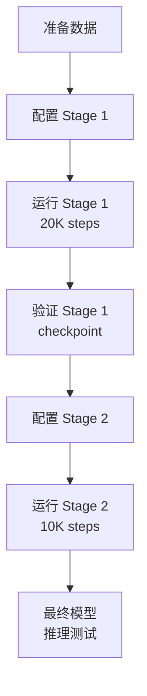

# Fantasy World 两阶段训练 - 文档索引

本目录包含 Fantasy World geometry-aware video generation 的完整两阶段训练实现。

---

## 📚 文档导航

### 🚀 快速开始
1. **[CHECKLIST.md](./CHECKLIST.md)** - 训练前检查清单
   - 环境检查、数据准备、配置步骤
   - Stage 1 和 Stage 2 的完整 checklist
   - 故障排查指南

### 📖 完整指南
2. **[TWO_STAGE_TRAINING_GUIDE.md](./TWO_STAGE_TRAINING_GUIDE.md)** - 用户完整指南
   - 论文中的训练策略详解 (Section 4.3)
   - Stage 1: Latent Bridging (20K steps, batch 64)
   - Stage 2: Unified Co-Optimization (10K steps, batch 112)
   - 使用方法、技术细节、FAQ

### 🔧 技术实现
3. **[TWO_STAGE_IMPLEMENTATION_SUMMARY.md](./TWO_STAGE_IMPLEMENTATION_SUMMARY.md)** - 技术总结
   - 代码修改详情
   - 架构设计决策
   - 参数统计和模块对照表
   - 论文对应关系

---

## 🎬 训练脚本

### Stage 1: Latent Bridging
- **[train_fantasy_world_stage1.sh](./train_fantasy_world_stage1.sh)** ⭐
  - 训练 geometry branch (latent_bridge, geo_blocks, heads)
  - 20,000 steps, batch size 64
  - 输出: `outputs/fantasy_world_stage1/step-20000.safetensors`

### Stage 2: Unified Co-Optimization
- **[train_fantasy_world_stage2.sh](./train_fantasy_world_stage2.sh)** ⭐
  - 在 Stage 1 基础上训练 interaction modules
  - 10,000 steps, batch size 112
  - 输出: `outputs/fantasy_world_stage2/step-10000.safetensors` (final model)

---

## 🛠️ 工具脚本

### 验证工具
- **[verify_two_stage_config.py](./verify_two_stage_config.py)**
  - 检查两阶段配置是否正确
  - 列出可训练模块和参数量
  - 运行: `python verify_two_stage_config.py`

### 测试脚本
- **[test_fantasy_world_training.sh](./test_fantasy_world_training.sh)**
  - 使用 fake data 快速测试训练流程
  - 验证环境配置和数据流

---

## 📊 训练概览

| 阶段 | 训练步数 | Batch Size | 分辨率 | 可训练参数 |
|------|---------|-----------|--------|-----------|
| **Stage 1** | 20,000 | 64 | 336×592 | ~956M |
| **Stage 2** | 10,000 | 112 | 592×336 | ~1186M |

### Stage 1 可训练模块
- ✅ Latent Bridge Adapter (~5M)
- ✅ GeoDiT Blocks (~900M)
- ✅ DPT Heads (~50M)
- ✅ Pose Encoder (~1M)
- ✅ Special Tokens (~0.01M)

### Stage 2 新增可训练
- ✅ IRG Cross-Attention (~200M)
- ✅ Camera Adapters (~30M)

### 始终冻结
- ❄️ Wan2.1 原有 30 blocks (PCB 12 + IRG 18, ~1616M)

---

## 🎯 使用流程



### 详细步骤

1. **准备数据**
   ```bash
   dataset/
   ├── videos/         # 原始视频
   ├── depth/          # Depth Anything V2 预测
   ├── points/         # DUSt3R 预测
   ├── camera_params/  # DUSt3R + PnP 估计
   └── metadata.json   # 数据集元信息
   ```

2. **运行 Stage 1**
   ```bash
   # 编辑脚本配置
   vim train_fantasy_world_stage1.sh
   
   # 运行训练
   bash train_fantasy_world_stage1.sh
   ```

3. **运行 Stage 2**
   ```bash
   # 编辑脚本配置
   vim train_fantasy_world_stage2.sh
   
   # 运行训练
   bash train_fantasy_world_stage2.sh
   ```

4. **推理测试**
   ```python
   from diffsynth import WanVideoPipeline
   
   pipe = WanVideoPipeline.from_pretrained(...)
   pipe.dit.enable_fantasy_world_mode(training_stage="stage2")
   
   video = pipe(
       prompt="...",
       pose_file_path="camera_trajectory.txt",
       num_frames=81,
   )
   ```

---

## 📖 相关文档

### 主项目文档
- [SETUP_GUIDE.md](../../../../docs/SETUP_GUIDE.md) - 环境搭建指南
- [ROPE_FIX_EXPLANATION.md](../../../../docs/ROPE_FIX_EXPLANATION.md) - RoPE 长度修复
- [DTYPE_FIX_EXPLANATION.md](../../../../docs/DTYPE_FIX_EXPLANATION.md) - DType 不匹配修复
- [INTERPOLATE_FIX_EXPLANATION.md](../../../../docs/INTERPOLATE_FIX_EXPLANATION.md) - 插值维度修复

### 代码位置
- `diffsynth/models/wan_video_dit.py` - DiT 架构 (enable_fantasy_world_mode)
- `examples/wanvideo/model_training/train.py` - 主训练脚本
- `diffsynth/diffusion/loss.py` - FantasyWorldLoss
- `diffsynth/core/data/fantasy_world_dataset.py` - 数据加载

---

## ❓ 常见问题

### Q: 为什么需要两阶段训练？
**A**: 直接联合训练会导致 geometry branch 学不到有效特征。两阶段策略先让 geometry branch 适配到稳定的 video features，再引入 interaction modules。

### Q: 显存不足怎么办？
**A**: 
- 减小 `BATCH_SIZE_PER_GPU`
- 增加 `GRADIENT_ACCUMULATION`
- 降低分辨率 (仅 Stage 1)
- 减少 frames

### Q: Stage 1 训练多久合适？
**A**: 论文用 20K steps。可以监控 geometry losses 来判断收敛：
- `depth_loss` < 0.1
- `point_loss` < 0.5
- `camera_loss` < 0.05

### Q: 必须从 Stage 1 checkpoint 开始 Stage 2 吗？
**A**: 是的。Stage 2 依赖 Stage 1 训练好的 geometry branch。

---

## 🔗 快速链接

- **开始训练**: [CHECKLIST.md](./CHECKLIST.md)
- **详细指南**: [TWO_STAGE_TRAINING_GUIDE.md](./TWO_STAGE_TRAINING_GUIDE.md)
- **技术细节**: [TWO_STAGE_IMPLEMENTATION_SUMMARY.md](./TWO_STAGE_IMPLEMENTATION_SUMMARY.md)
- **Stage 1 脚本**: [train_fantasy_world_stage1.sh](./train_fantasy_world_stage1.sh)
- **Stage 2 脚本**: [train_fantasy_world_stage2.sh](./train_fantasy_world_stage2.sh)
- **验证工具**: [verify_two_stage_config.py](./verify_two_stage_config.py)

---

## 📝 更新日志

- **2025-02-02**: 初始发布
  - 两阶段训练实现完成
  - 完整文档和工具脚本
  - 论文策略对齐验证

---

## 📧 支持

如遇问题，请查看:
1. [CHECKLIST.md](./CHECKLIST.md) 中的故障排查部分
2. [TWO_STAGE_TRAINING_GUIDE.md](./TWO_STAGE_TRAINING_GUIDE.md) 的 FAQ
3. 主项目 docs/ 目录中的修复文档

**祝训练顺利！** 🚀
